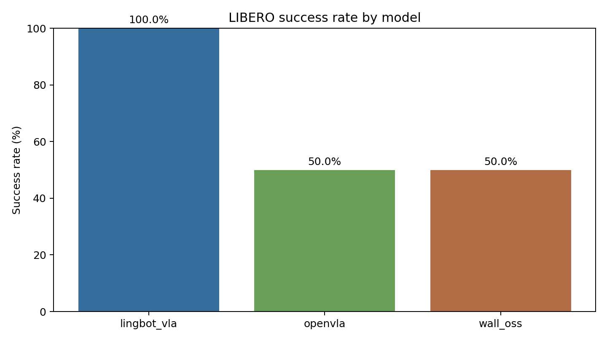
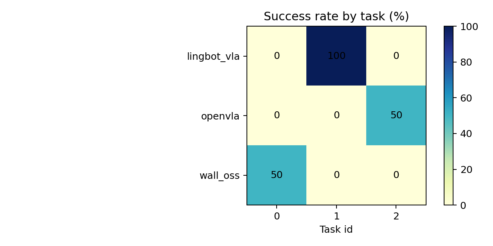
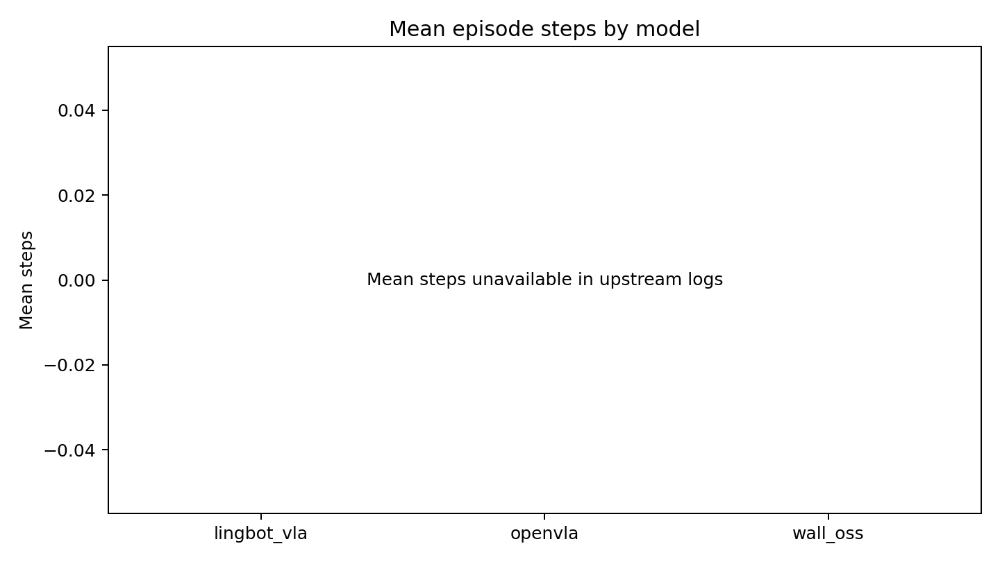
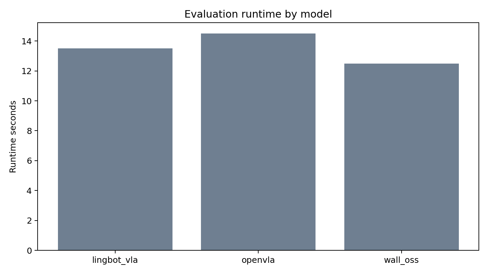
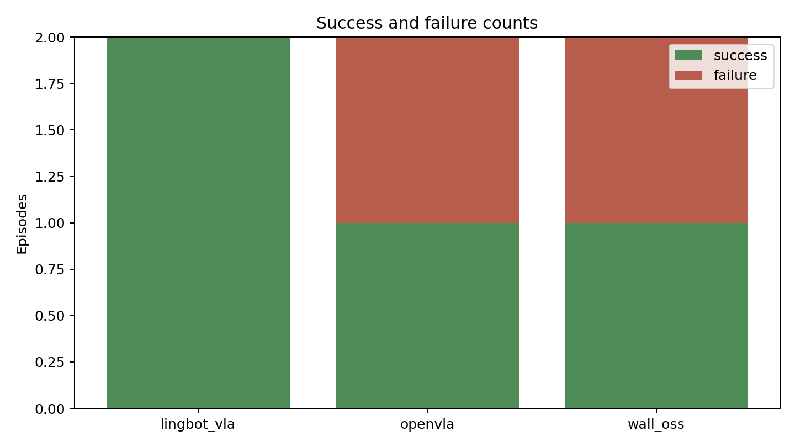

# VLA Evaluation Report

生成时间：2026-06-18T16:54:54

运行目录：`outputs/sample`

## 任务对齐校验

_No manifest found._

## 模型总览

| model_name | num_episodes | num_successes | num_failures | success_rate | runtime_seconds | seconds_per_episode |
| --- | --- | --- | --- | --- | --- | --- |
| lingbot_vla | 2 | 2 | 0 | 1.0 | 13.5 | 6.75 |
| openvla | 2 | 1 | 1 | 0.5 | 14.5 | 7.25 |
| wall_oss | 2 | 1 | 1 | 0.5 | 12.5 | 6.25 |

## 任务明细

| model_name | task_id | task_description | num_episodes | num_successes | success_rate | runtime_seconds |
| --- | --- | --- | --- | --- | --- | --- |
| lingbot_vla | 1 | open the middle drawer | 2 | 2 | 1.0 | 13.5 |
| openvla | 2 | move the mug to the left | 2 | 1 | 0.5 | 14.5 |
| wall_oss | 0 | put the bowl on the plate | 2 | 1 | 0.5 | 12.5 |

## 图表

## 指标解释

- `success_rate`：成功 episode 数除以总 episode 数，是闭环仿真评测的核心指标。
- `runtime_seconds`：对应模型评测命令的 wall-clock 耗时。
- `seconds_per_episode`：平均每个 episode 的评测耗时，用于估算完整评测成本。
- `mean_steps`：平均交互步数。当前上游日志未稳定输出每个 episode 步数时，该字段为空。
- `failure_reason`：失败归因见 `metrics/episodes.csv`，主要区分未成功、异常和非零退出。

## 说明

默认配置是报告友好小样本，适合快速制作横向比较素材；若用于正式结论，请增加任务数和每任务 episode 数。
